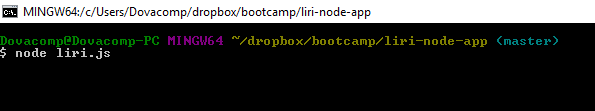
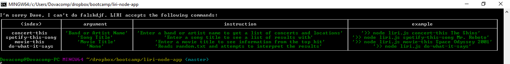
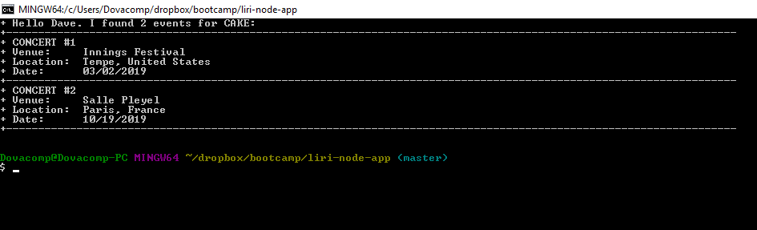
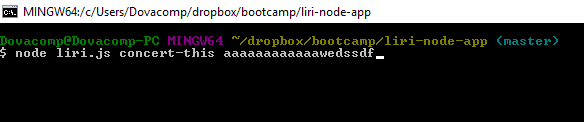
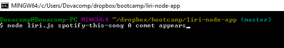
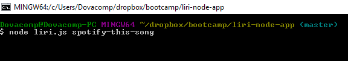
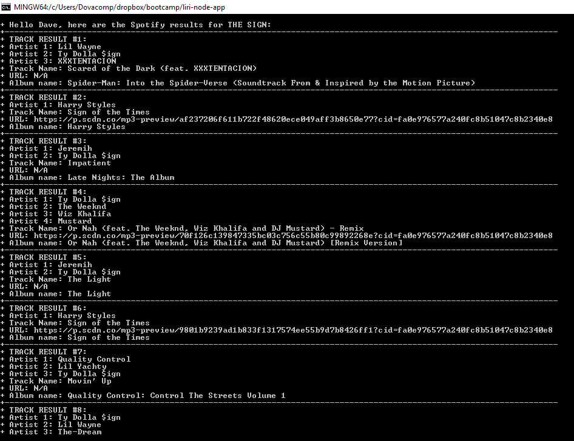

# LIRI (**L**anguage **I**nterpretation and **R**ecognition **I**nterface ) Bot
Welcome to LIRI, your new command-line personal assisstant! Below is a quick guide to get you started using LIRI.

## Prework
1. Be sure to clone the git project to the directory of your choosing.
2. Run npm install from the console at the directy you installed LIRI to make sure you get all the required dependencies
3. Before you can start enjoying LIRI, make sure you add the following to your .env file:

**//Spotify API Key**

SPOTIFY_ID= _your-ID_

SPOTIFY_SECRET= _your-secret_

**//OMDB API key**

OMDB_ID="_your-api-key_"

**//BandCamp API**

BANDCAMP_ID="_your-api-key_"

You can sign up for a free Spotify API key [here](https://developer.spotify.com/my-applications/#!/).
You can sign up for a free OMDB API key [here](http://www.omdbapi.com/apikey.aspx).
You can get information and request a BandCamp API key [here](https://bandcamp.com/developer#calling_the_api).

## Using LIRI

Now you are ready to go! From the console, you can access LIRI by typing:

```$ node "file path for liri.js" "command" "input"```

|Command|Description|Example|
|-------|-----------|-------|
|movie-this|  Use this to find information about the movie in the input field | `node liri.js movie-this 2001: A Space Odyssey` |
|Spotify-this-song|  Use this to find information for up to 20 tracks about the input field | `node liri.js spotify-this-song Mr. Roboto` |
|concert-this|  Use this to find a list of upcoming events for the inputted band / artist | `node liri.js concert-this Cake` |
|do-what-it-says|  LIRI will read 'random.txt' and attempt to interpret the command and input | `node liri.js do-what-it-says` |

## Examples

1. Case: No Input

| Case | Entry | Output |
|:---: |:-----:|:------:| 
| No Entry |  |  |
| Bad Command |  |  |
| concert-this |  |  |
| concert-this: No argument |  |  |
| concert-this: no results |  |  |
| spotify-this-song |  |  |
| spotify-this-song: No argument |  |  |
| spotify-this-song: no results |  |  |

